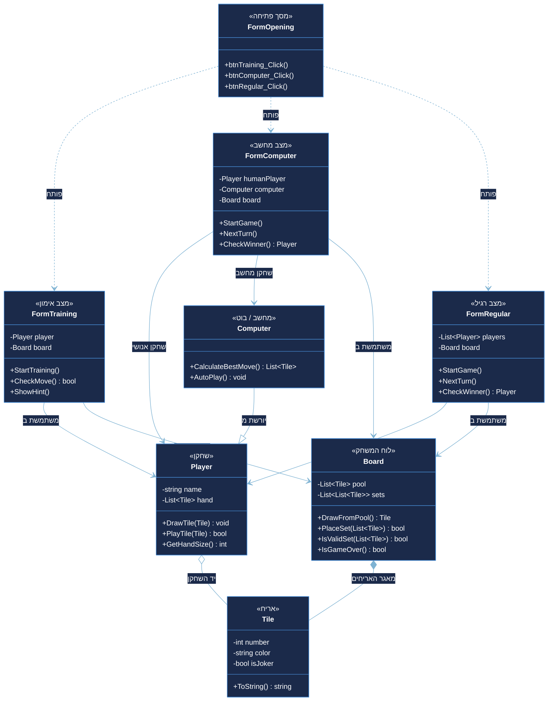
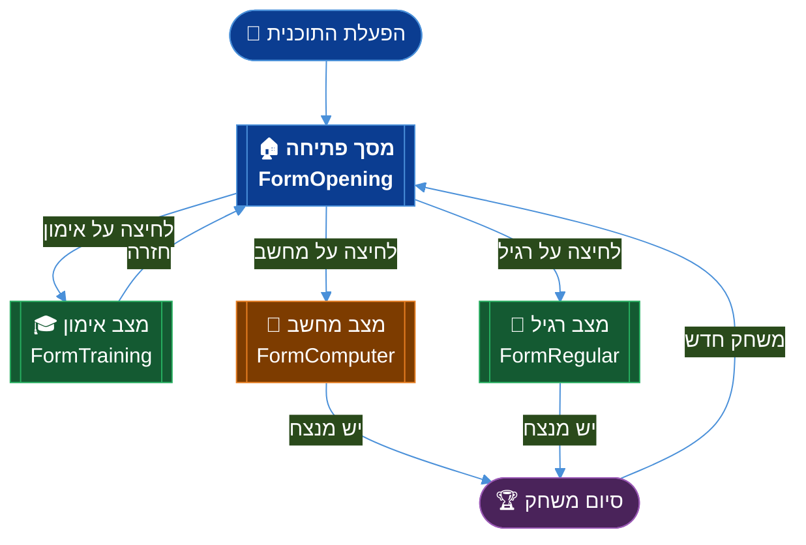
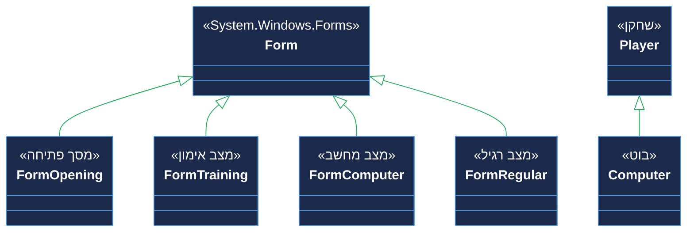

# דיאגרמות מחלקות — Remikob2026tamar
### משחק רמיקוב — C# Windows Forms

> **מאגר:** [`tamaravami-hub/Remikob2026tamar`](https://github.com/tamaravami-hub/Remikob2026tamar)

---

## דיאגרמת מחלקות מלאה

---

## זרימת ניווט בין המסכים

---

## הירארכיית ירושה

---

## סיכום קשרים

| מחלקה | קשר | מחלקה שניה | סוג |
|:---:|:---:|:---:|:---:|
| `FormOpening` | פותחת | `FormTraining` | תלות |
| `FormOpening` | פותחת | `FormComputer` | תלות |
| `FormOpening` | פותחת | `FormRegular` | תלות |
| `FormTraining` | משתמשת ב | `Player`, `Board` | אסוציאציה |
| `FormComputer` | משתמשת ב | `Player`, `Computer`, `Board` | אסוציאציה |
| `FormRegular` | משתמשת ב | `Player` (רשימה), `Board` | אסוציאציה |
| `Computer` | יורשת מ | `Player` | ירושה |
| `Player` | מכיל | `Tile` (יד) | אגרגציה |
| `Board` | מכיל | `Tile` (מאגר) | קומפוזיציה |

---

## מפתח צבעים

| צבע | משמעות |
|:---:|---|
| 🔵 כחול כהה | מסכים / Forms |
| 🟢 ירוק | ישויות משחק (שחקן, לוח) |
| 🟠 כתום | מחשב / בוט |
| 🟣 סגול | אריחים |
