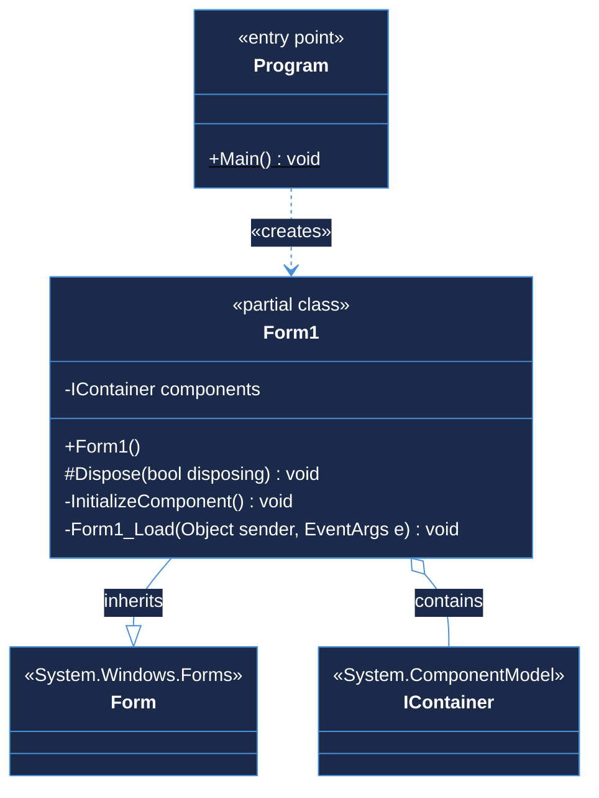
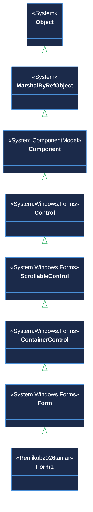

# Class Diagrams — Remikob2026tamar

> **Source:** [`tamaravami-hub/Remikob2026tamar`](https://github.com/tamaravami-hub/Remikob2026tamar) · C# Windows Forms Application

---

## Full Class Diagram

---

## Inheritance Hierarchy

---

## Relationships at a Glance

| Symbol | Type | From → To | Meaning |
|:------:|------|-----------|---------|
| `--|>` | **Inheritance** | `Form1` → `Form` | `Form1` extends the WinForms `Form` base class |
| `o--`  | **Aggregation** | `Form1` → `IContainer` | `Form1` holds a `components` field for designer-managed child controls |
| `..>`  | **Dependency**  | `Program` → `Form1` | `Program.Main()` instantiates `Form1` and runs it via `Application.Run()` |

---

## Class Reference

### `Program`

| | |
|---|---|
| **File** | `Program.cs` |
| **Kind** | `internal static class` |
| **Namespace** | `Remikob2026tamar` |
| **Role** | Application entry point |

| Visibility | Member | Signature | Notes |
|:---:|---|---|---|
| `+` | `Main` | `static void Main()` | `[STAThread]` — required for COM/WinForms |

---

### `Form1`

| | |
|---|---|
| **Files** | `Form1.cs` · `Form1.Designer.cs` |
| **Kind** | `public partial class` |
| **Namespace** | `Remikob2026tamar` |
| **Inherits** | `System.Windows.Forms.Form` |
| **Role** | Main application window |

| Visibility | Member | Signature | Notes |
|:---:|---|---|---|
| `-` | `components` | `IContainer components` | Designer-managed child controls |
| `+` | `Form1()` | constructor | Calls `InitializeComponent()` |
| `#` | `Dispose` | `override void Dispose(bool disposing)` | Disposes `components` when managed |
| `-` | `InitializeComponent` | `void InitializeComponent()` | Auto-generated by WinForms designer |
| `-` | `Form1_Load` | `void Form1_Load(object sender, EventArgs e)` | Fires on form load *(currently empty)* |
