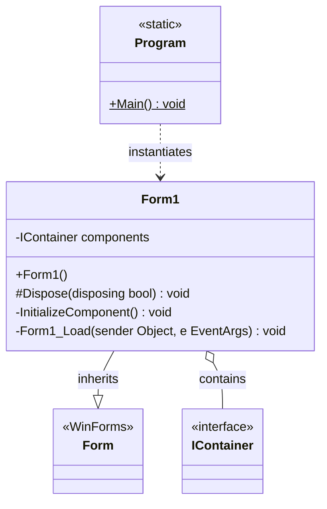

# Class Diagrams — Remikob2026tamar

Source repository: https://github.com/tamaravami-hub/Remikob2026tamar

This is a C# Windows Forms application. The diagrams below cover all classes and their connections.

---

## Full Class Diagram

---

## Relationships Explained

| Relationship | From | To | Type | Details |
|---|---|---|---|---|
| Inheritance | `Form1` | `Form` (System.Windows.Forms) | `--|>` | `Form1` extends the WinForms `Form` base class |
| Composition | `Form1` | `IContainer` | `o--` | `Form1` owns a private `components: IContainer` field used to manage child controls |
| Dependency | `Program` | `Form1` | `..>` | `Program.Main()` instantiates `Form1` and passes it to `Application.Run()` |

---

## Per-Class Details

### `Program` (`Program.cs`)
- **Kind:** `internal static class`
- **Namespace:** `Remikob2026tamar`
- **Responsibility:** Application entry point. Enables visual styles and launches `Form1`.

| Member | Signature | Notes |
|---|---|---|
| `Main` | `static void Main()` | `[STAThread]` — required for WinForms |

---

### `Form1` (`Form1.cs` + `Form1.Designer.cs`)
- **Kind:** `public partial class`
- **Namespace:** `Remikob2026tamar`
- **Inherits:** `System.Windows.Forms.Form`
- **Responsibility:** Main application window.

| Member | Visibility | Signature | Notes |
|---|---|---|---|
| `components` | `private` | `IContainer components` | Holds designer-managed child controls |
| `Form1()` | `public` | constructor | Calls `InitializeComponent()` |
| `Dispose` | `protected override` | `void Dispose(bool disposing)` | Disposes `components` if managed |
| `InitializeComponent` | `private` | `void InitializeComponent()` | Designer-generated — sets up the form |
| `Form1_Load` | `private` | `void Form1_Load(object sender, EventArgs e)` | Fires on form load (currently empty) |
